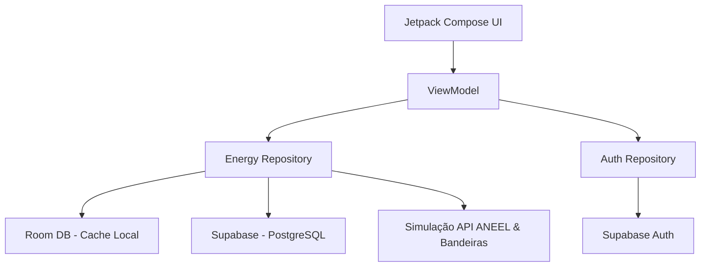
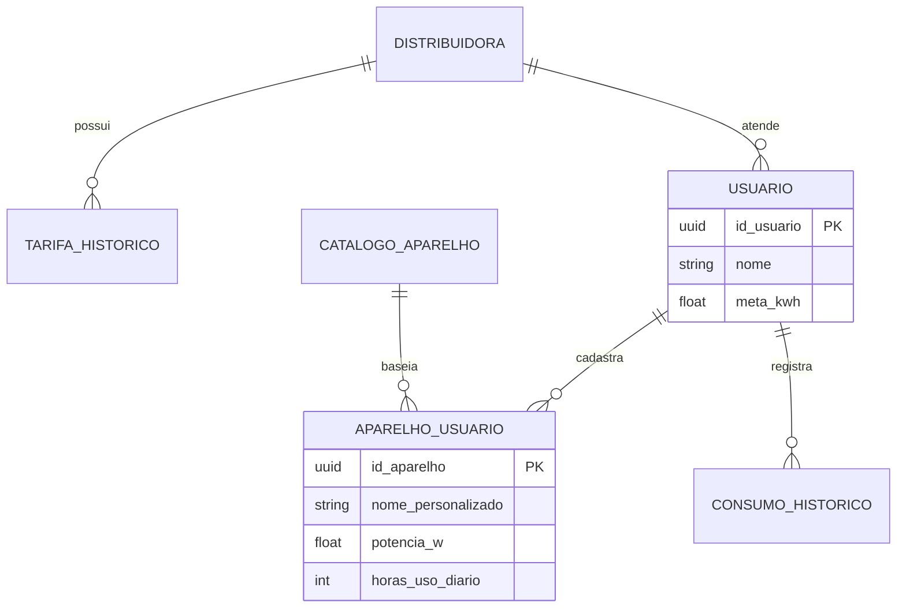

# Energia Inteligente 

O **Energia Inteligente** é um aplicativo Android desenvolvido com Jetpack Compose focado no monitoramento e previsão de gastos com energia elétrica de forma precisa, resiliente (Offline-First) e inteligente.

O aplicativo utiliza dados em tempo real da **ANEEL** (Tarifas e Bandeiras) e geolocalização automática para entregar ao usuário o custo exato do consumo de seus eletrodomésticos, integrando-se à nuvem via **Supabase**.

---

##  Principais Funcionalidades

- **Cálculo de Consumo Real**: Baseado nas fórmulas de engenharia elétrica, considerando potência (W) e tempo de uso.
- **Detecção Automática de Região (GPS)**: Identifica o Estado (UF) e sugere as distribuidoras de energia locais.
- **Integração ANEEL & Bandeiras**: Aplicação automática de tarifas base (TE + TUSD) e adicionais de bandeiras (Verde, Amarela, Vermelha).
- **Cálculo de Impostos Estaduais**: Cálculo preciso de ICMS baseado na UF detectada.
- **Modo Offline-First**: O app funciona 100% sem internet utilizando banco de dados local **Room**, sincronizando com o **Supabase/PostgreSQL** assim que a conexão retorna.
- **Dark Mode Premium**: Interface moderna projetada para eficiência energética e conforto visual.

---

##  Arquitetura Técnica

O projeto segue a arquitetura **MVVM (Model-View-ViewModel)** recomendada pelo Google:

### Tecnologias Utilizadas:
- **UI**: Jetpack Compose (Declarative UI)
- **Banco Local**: Room Persistence Library
- **Backend/Auth**: Supabase (PostgreSQL + Auth)
- **Localização**: Fused Location Provider API & Geocoder
- **Sincronização**: WorkManager (Android Jetpack)
- **Rede**: Ktor Client

---

##  Modelo de Dados (ER)

O banco de dados foi projetado para suportar histórico de consumo e catálogo de aparelhos sugeridos:

---

## 🎨 Guia de Estilo (UI)

- **Fundo**: `#0C0F12`
- **Cards**: `#161B22`
- **Primária**: `#00E676` (Verde Elétrico)
- **Texto**: `#FFFFFF` / `#8B949E`

---

